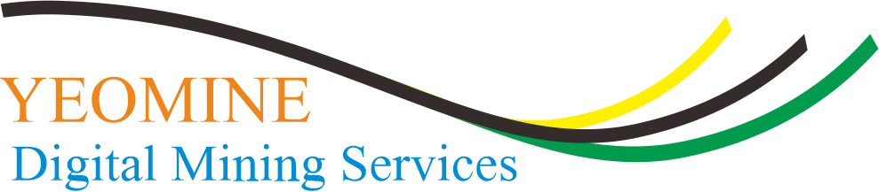

<!---
Copyright 2023 The Yeomine Team. All rights reserved.

Licensed under the Apache License, Version 2.0 (the "License");
you may not use this file except in compliance with the License.
You may obtain a copy of the License at

    http://www.apache.org/licenses/LICENSE-2.0

Unless required by applicable law or agreed to in writing, software
distributed under the License is distributed on an "AS IS" BASIS,
WITHOUT WARRANTIES OR CONDITIONS OF ANY KIND, either express or implied.
See the License for the specific language governing permissions and
limitations under the License.
-->

<h3 align="center">
    <a href="https://hf.co/course"></a>
</h3>

## Introduction

<p align="justify">
Yeomine is a product that is built by a web and desktop application using python language as backend and streamlit
as framework. This is integrated with computer vision technology using YoloV8 Model that is developed 
with thousands of actual and valid open coal mining data.

In Yeomine, there is a recommendation and prediction system that is very helpful in achieving coal extraction targets in open pit mines. 
This system or application can help maintain energy stability by optimizing the control of coal production.
</p>


These application can applied on the several object like:
1. Coal Getting
2. Typical Seam
3. Core Logging
4. HSE Safety (Helmet detection)
5. General Custom Object
6. Fuel Scheduling

## Quick tour

To immediately use this app, we provide you to follow this step. 

- Make sure that you have installed python before.
If you didn't do it yet, you can follow this [instruction](https://www.python.org/downloads) how to install python in your PC/laptop.
Recommended to install **python version >= 3.9.**
- If you have already python in your PC/laptop, open your command prompt.
- Write the correct path yeomine folder.
``` 
cd [YOUR-PATH]/yeomine
``` 
- After that, you can create environment python. (For the example, your environment name is **machine-learning**)
```
python -m venv [NAME-YOUR-ENVIRONMENT]
python -m venv machine-learning
``` 
- Go to the path env that have created before.
```
cd [NAME-YOUR-ENVIRONMENT]
cd machine-learning
```
- Next, activate your python environment.
```
Scripts\activate [in Windows]
source bin\activate [in Linux and IOS]
```
- Go back to the folder yeomine
``` 
cd ..
```
- Install the requirement packages for this app.
```
pip install -r requirements.txt
```
- Finally, you can run this app using streamlit framework.
```
streamlit run 🏠_Home.py
```